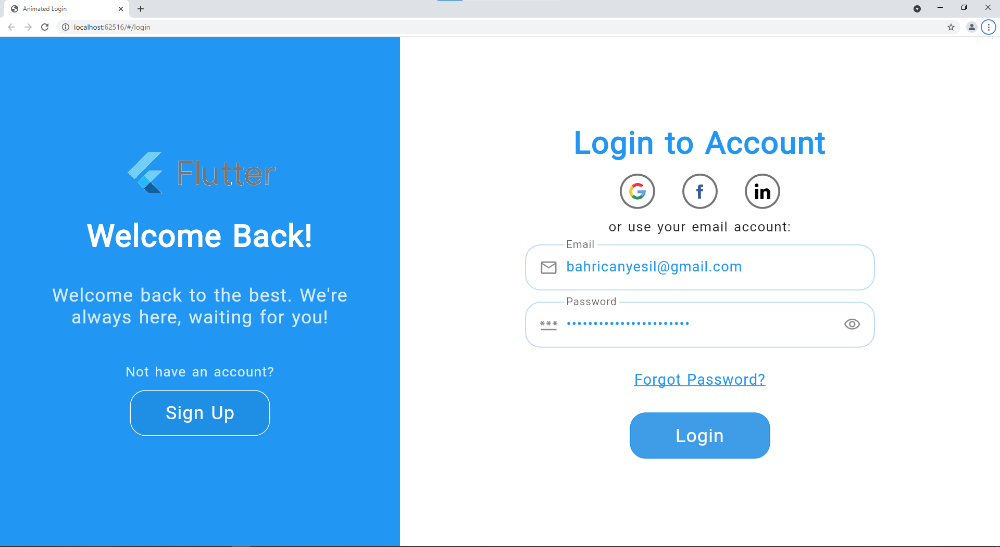
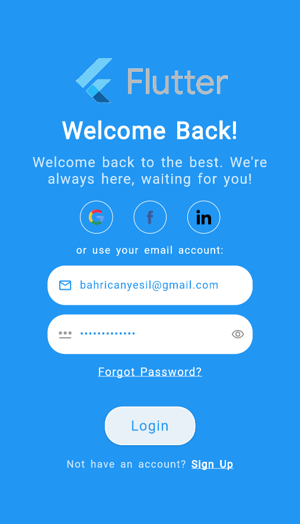
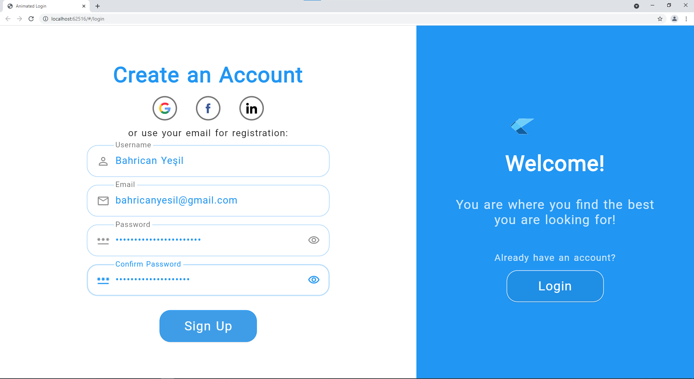
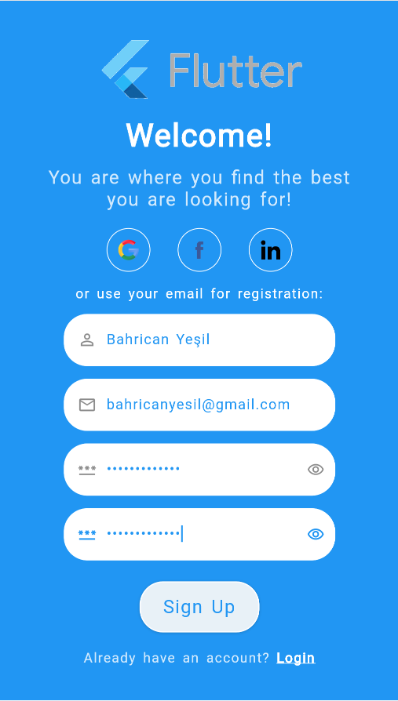
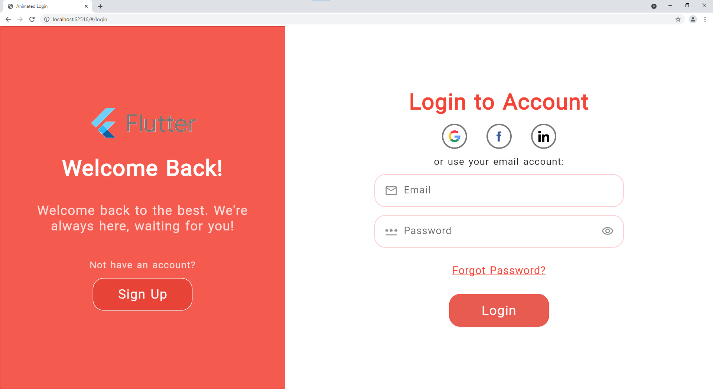
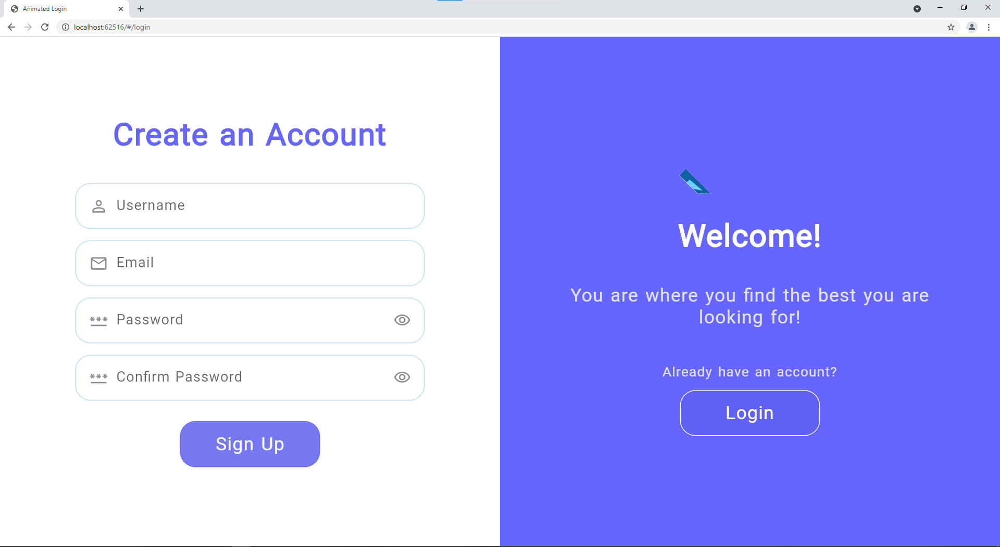
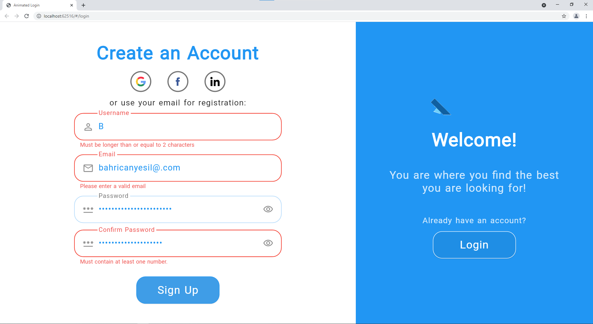

# Flutter Animated Login

`Flutter Animated Login` is a ready-made login/signup screen with soft and pleasant animations.
It is fully responsible to be able to use on both web and mobile apps.

 

## Installation

You can follow the instructions for installation [here](https://pub.dev/packages/flutter-animated-login#-installing-tab-)

## Reference

| Property                  | Type                                | Description                                                                                                                                           |
| ------------------------- | ----------------------------------- | ----------------------------------------------------------------------------------------------------------------------------------------------------- |
| onSignup                  | `SignupCallback`]                   | <sub>Signup callback that will be called after signup button pressed.</sub>                                                                           |
| onLogin                   | `LoginCallback`]                    | <sub>Login callback that will be called after login button pressed.</sub>                                                                             |
| socialLogins              | [`List<SocialLogin>`](#SocialLogin) | <sub>List of social login options that will be provided.</sub>                                                                                        |
| loginTexts                | [`LoginTexts`](#LoginTexts)         | <sub>Determines all of the texts on the screen.</sub>                                                                                                 |
| loginTheme                | [`LoginTheme`](#LoginTheme)         | <sub>Determines all of the theme related variables on the screen.</sub>                                                                               |
| onForgotPassword          | `ForgotPasswordCallback`            | <sub>Callback that will be called after on tap of forgot password text. Commonly it navigates user to a screen to reset the password.</sub>           |
| animationCurve            | `Curve`                             | <sub>Custom animation curve that will be used for animations.</sub>                                                                                   |
| formWidthRatio            | `double`                            | <sub>Ratio of width of the form to the width of the screen.</sub>                                                                                     |
| animationDuration         | `Duration`                          | <sub>The duration of the animations.</sub>                                                                                                            |
| formKey                   | `GlobalKey<FormState>`              | <sub> The optional custom form key, if not provided will be created locally.</sub>                                                                    |
| formElementsSpacing       | `double`                            | <sub>The spacing between the elements of form.</sub>                                                                                                  |
| socialLoginsSpacing       | `double`                            | <sub>The spacing between the social login options.</sub>                                                                                              |
| checkError                | `bool`                              | <sub>Indicates whether the login screen should handle errors, show the error messages returned from the callbacks in a dialog.</sub>                  |
| showForgotPassword        | `bool`                              | <sub>Indicates whether the forgot password option will be enabled.</sub>                                                                              |
| showChangeActionTitle     | `bool`                              | <sub>Indicates whether the change action title should be displayed.</sub>                                                                             |
| showPasswordVisibility    | `bool`                              | <sub>Indicates whether the user can show the password text without obscuring.</sub>                                                                   |
| nameController            | `TextEditingController`             | <sub>Optional TextEditingController for name input field.</sub>                                                                                       |
| emailController           | `TextEditingController`             | <sub>Optional TextEditingController for email input field.</sub>                                                                                      |
| passwordController        | `TextEditingController`             | <sub>Optional TextEditingController for password input field.</sub>                                                                                   |
| confirmPasswordController | `TextEditingController`             | <sub>Optional TextEditingController for confirm password input field.</sub>                                                                           |
| actionButtonStyle         | `ButtonStyle`                       | <sub>Custom button style for action button (login/signup).</sub>                                                                                      |
| changeActionButtonStyle   | `ButtonStyle`                       | <sub>Custom button style for change action button that will switch auth mode.</sub>                                                                   |
| welcomePadding            | `EdgeInsets`                        | <sub>Padding of the welcome part widget.</sub>                                                                                                        |
| formPadding               | `EdgeInsets`                        | <sub>Padding of the form part widget.</sub>                                                                                                           |
| backgroundImage           | `String`                            | <sub>Full asset image path for background of the welcome part.</sub>                                                                                  |
| logo                      | `String`                            | <sub>Full asset image path for the logo.</sub>                                                                                                        |
| logoSize                  | `Size`                              | <sub>Size of the logo in the welcome part.</sub>                                                                                                      |
| signUpMode                | [`SignUpModes`](#SignUpModes)       | <sub>Enum to determine which text form fields should be displayed in addition to the email and password fields: Name / Confirm Password / Both.</sub> |


### LoginTexts

| Property               | Type     | Description                                                              |
| ---------------------- | -------- | ------------------------------------------------------------------------ |
| welcome                | `String` | Welcome title in signUp mode for the informing part.                     |
| welcomeDescription     | `String` | Welcome description in signUp mode for the informing part.               |
| signUp                 | `String` | Action button text for sign up mode.                                     |
| signUpFormTitle        | `String` | Form title for sign up mode.                                             |
| signUpUseEmail         | `String` | Use email CTA for sign up mode.                                          |
| welcomeBack            | `String` | Welcome title in login mode for the informing part.                      |
| welcomeBackDescription | `String` | Welcome description in login mode for the informing part.                |
| login                  | `String` | Action button text for login mode.                                       |
| loginFormTitle         | `String` | Form title for login mode.                                               |
| loginUseEmail          | `String` | Use email CTA for login mode.                                            |
| forgotPassword         | `String` | Forgot password text for login mode.                                     |
| notHaveAnAccount       | `String` | Text above the sign up button to direct users who don't have an account. |
| alreadyHaveAnAccount   | `String` | Text above the login button to direct users who already have an account. |
| nameHint               | `String` | Hint text for name [TextFormField]                                       |
| emailHint              | `String` | Hint text for email [TextFormField]                                      |
| passwordHint           | `String` | Hint text for password [TextFormField]                                   |
| confirmPasswordHint    | `String` | Hint text for confirm password [TextFormField]                           |
| passwordMatchingError  | `String` | The error text for not matching password and confirm password inputs.    |
| dialogButtonText       | `String` | The button text of error dialog.                                         |

### LoginTheme

| Property                 | Type              | Description                                                                          |
| ------------------------ | ----------------- | ------------------------------------------------------------------------------------ |
| formTitleStyle           | `TextStyle`       | Text style for the title of form part.                                               |
| welcomeTitleStyle        | `TextStyle`       | Text style for the title of welcome part.                                            |
| welcomeDescriptionStyle  | `TextStyle`       | Text style for the description of welcome part.                                      |
| changeActionStyle        | `TextStyle`       | Text style for the change action CTA of welcome part.                                |
| useEmailStyle            | `TextStyle`       | Text style for the use email text of form part.                                      |
| forgotPasswordStyle      | `TextStyle`       | Text style for the forgot password CTA of form part.                                 |
| hintTextStyle            | `TextStyle`       | Text style for hint texts in the text form fields.                                   |
| errorTextStyle           | `TextStyle`       | Text style for error texts in the text form fields.                                  |
| textFormStyle            | `TextStyle`       | Text style for input texts in the text form fields.                                  |
| actionTextStyle          | `TextStyle`       | Text style for action button text in the form part.                                  |
| changeActionTextStyle    | `TextStyle`       | Text style for change action button text in the welcome part.                        |
| textFormFieldDeco        | `InputDecoration` | Input decoration for the text form fields.                                           |
| nameIcon                 | `Widget`          | Prefix widget for name text form field.                                              |
| emailIcon                | `Widget`          | Prefix widget for email text form field.                                             |
| passwordIcon             | `Widget`          | Prefix widget for password text form field.                                          |
| formFieldElevation       | `double`          | Elevation for text form fields.                                                      |
| formFieldBackgroundColor | `Color`           | Background color for text form fields.                                               |
| formFieldShadowColor     | `Color`           | Shadow color for text form fields.                                                   |
| formFieldBorderRadius    | `BorderRadius`    | Border radius for text form fields.                                                  |
| formFieldSize            | `Size`            | Size of text form fields.                                                            |
| formFieldHoverColor      | `Color`           | Hover color for text form fields.                                                    |
| backgroundColor          | `Color`           | Background color of the login screen.                                                |
| errorBorderColor         | `Color`           | Error border color for text form fields.                                             |
| focusedErrorBorderColor  | `Color`           | Focused error border color for text form fields.                                     |
| focusedBorderColor       | `Color`           | Focused border color for text form fields.                                           |
| enabledBorderColor       | `Color`           | Enabled border color for text form fields.                                           |
| enabledBorder            | `InputBorder`     | Enabled border for text form fields.                                                 |
| errorBorder              | `InputBorder`     | Error border for text form fields.                                                   |
| focusedErrorBorder       | `InputBorder`     | Focused error border for text form fields.                                           |
| focusedBorder            | `InputBorder`     | Focused border for text form fields.                                                 |
| showFormFieldErrors      | `bool`            | Indicates whether the error messages should be displayed below the text form fields. |
| showLabelTexts           | `bool`            | Indicates whether the labels should be displayed above the text form fields.         |
| socialLoginHoverColor    | `Color`           | Hover color for social login widgets.                                                |
| socialLoginBorder        | `BorderSide`      | Border for social login widgets.                                                     |

### SocialLogin

| Property | Type                  | Description                                                          |
| -------- | --------------------- | -------------------------------------------------------------------- |
| iconPath | `String`              | Full asset path of the social platform logo.                         |
| callback | `SocialLoginCallback` | The callback will be called on click to logo of the social platform. |

### LoginData

| Property | Type     | Description                                                    |
| -------- | -------- | -------------------------------------------------------------- |
| email    | `String` | Email text the user entered to the email [TextFormField]       |
| password | `String` | Password text the user entered to the password [TextFormField] |

### SignUpData

| Property        | Type     | Description                                                                    |
| --------------- | -------- | ------------------------------------------------------------------------------ |
| name            | `String` | Name text the user entered to the name [TextFormField]                         |
| email           | `String` | Email text the user entered to the email [TextFormField]                       |
| password        | `String` | Password text the user entered to the password [TextFormField]                 |
| confirmPassword | `String` | Confirm password text the user entered to the confirm password [TextFormField] |

### SignUpModes

| Enum            | Description                                                        |
| --------------- | ------------------------------------------------------------------ |
| name            | Only displays name text form field, not displays confirm password. |
| confirmPassword | Only displays confirm password form field, not name.               |
| both            | Displays both name and confirm password text form fields.          |

Sign up modes to determine which text form fields should be displayed.


## Complete Example

You can see the complete example in the example folder with example project. The video recordings for the example project are shown above via gifs.

### Basic example

```dart
import 'package:flutter/material.dart';
import 'package:animated_login/animated_login.dart';
class LoginScreen extends StatelessWidget {
  const LoginScreen({Key? key}) : super(key: key);

  /// Simulates the multilanguage, you will implement your own logic.
  /// According to the current language, you can display a text message
  /// with the help of [LoginTexts] class.
  final String langCode = 'en';

  @override
  Widget build(BuildContext context) {
    return AnimatedLogin(
      onLogin: onLogin,
      onSignup: onSignup,
      onForgotPassword: onForgotPassword,
      formWidthRatio: 60,
      logo: 'images/logo.gif',
      // backgroundImage: 'images/background_image.jpg',
      signUpMode: SignUpModes.both,
      loginTheme: _loginTheme,
      loginTexts: _loginTexts,
    );
  }

  /// You can adjust the colors, text styles, button styles, borders
  /// according to your design preferences.
  /// You can also set some additional display options such as [showLabelTexts].
  LoginTheme get _loginTheme => LoginTheme(
        // showLabelTexts: false,
        backgroundColor: Colors.blue, // const Color(0xFF6666FF),
        formFieldBackgroundColor: Colors.white,
        changeActionTextStyle: const TextStyle(color: Colors.white),
      );

  LoginTexts get _loginTexts => LoginTexts(
        nameHint: _username,
        login: _login,
        signUp: _signup,
      );

  /// You can adjust the texts in the screen according to the current language
  /// With the help of [LoginTexts], you can create a multilanguage scren.
  String get _username => langCode == 'tr' ? 'Kullanıcı Adı' : 'Username';
  String get _login => langCode == 'tr' ? 'Giriş Yap' : 'Login';
  String get _signup => langCode == 'tr' ? 'Kayıt Ol' : 'Sign Up';

  /// Login action that will be performed on click to action button in login mode.
  Future<String?> onLogin(LoginData loginData) async {
    await Future.delayed(const Duration(seconds: 2));
    print('Successfully logged in.');
    return null;
  }

  /// Sign up action that will be performed on click to action button in sign up mode.
  Future<String?> onSignup(SignUpData loginData) async {
    await Future.delayed(const Duration(seconds: 2));
    print('Successfully signed up.');
    return null;
  }

  /// Action that will be performed on click to "Forgot Password?" text/CTA.
  /// Probably you will navigate user to a page to create a new password after the verification.
  Future<String?> onForgotPassword(String email) async {
    await Future.delayed(const Duration(seconds: 2));
    print('Successfully navigated.');
    return null;
  }
}
```

### Basic example with social login options and data checks

```dart
import 'package:flutter/material.dart';
import 'package:animated_login/animated_login.dart';

class LoginScreen extends StatelessWidget {
  const LoginScreen({Key? key}) : super(key: key);

  /// Simulates the multilanguage, you will implement your own logic.
  /// According to the current language, you can display a text message
  /// with the help of [LoginTexts] class.
  final String langCode = 'en';

  @override
  Widget build(BuildContext context) {
    return AnimatedLogin(
      onLogin: onLogin,
      onSignup: onSignup,
      onForgotPassword: onForgotPassword,
      formWidthRatio: 60,
      logo: 'images/logo.gif',
      // backgroundImage: 'images/background_image.jpg',
      signUpMode: SignUpModes.both,
      socialLogins: _socialLogins,
      loginTheme: _loginTheme,
      loginTexts: _loginTexts,
    );
  }

  /// You can adjust the colors, text styles, button styles, borders
  /// according to your design preferences.
  /// You can also set some additional display options such as [showLabelTexts].
  LoginTheme get _loginTheme => LoginTheme(
        // showLabelTexts: false,
        backgroundColor: Colors.blue, // const Color(0xFF6666FF),
        formFieldBackgroundColor: Colors.white,
        changeActionTextStyle: const TextStyle(color: Colors.white),
      );

  LoginTexts get _loginTexts => LoginTexts(
        nameHint: _username,
        login: _login,
        signUp: _signup,
      );

  /// You can adjust the texts in the screen according to the current language
  /// With the help of [LoginTexts], you can create a multilanguage scren.
  String get _username => langCode == 'tr' ? 'Kullanıcı Adı' : 'Username';
  String get _login => langCode == 'tr' ? 'Giriş Yap' : 'Login';
  String get _signup => langCode == 'tr' ? 'Kayıt Ol' : 'Sign Up';

  /// Social login options, you should provide callback function and icon path.
  /// Icon paths should be the full path in the assets
  /// Don't forget to also add the icon folder to the "pubspec.yaml" file.
  List<SocialLogin> get _socialLogins => <SocialLogin>[
        SocialLogin(
            callback: () async => socialLogin('Google'),
            iconPath: 'images/google.png'),
        SocialLogin(
            callback: () async => socialLogin('Facebook'),
            iconPath: 'images/facebook.png'),
        SocialLogin(
            callback: () async => socialLogin('Linkedin'),
            iconPath: 'images/linkedin.png'),
      ];

  /// Login action that will be performed on click to action button in login mode.
  Future<String?> onLogin(LoginData loginData) async {
    await Future.delayed(const Duration(seconds: 2));
    print("""
    Successfully logged in.\n
    Email: ${loginData.email}\n
    Password: ${loginData.password}""");
    return null;
  }

  /// Sign up action that will be performed on click to action button in sign up mode.
  Future<String?> onSignup(SignUpData signupData) async {
    await Future.delayed(const Duration(seconds: 2));
    print("""
    Successfully signed up.\n
    Username: ${signupData.name}\n
    Email: ${signupData.email}\n
    Password: ${signupData.password}\n
    Confirm Password: ${signupData.confirmPassword}""");
    return null;
  }

  /// Action that will be performed on click to "Forgot Password?" text/CTA.
  /// Probably you will navigate user to a page to create a new password after the verification.
  Future<String?> onForgotPassword(String email) async {
    await Future.delayed(const Duration(seconds: 2));
    print('Successfully navigated. Email is $email');
    return null;
  }

  /// Social login callback example.
  Future<String?> socialLogin(String type) async {
    await Future.delayed(const Duration(seconds: 2));
    print('Successfully logged in with $type.');
    return null;
  }
}
```

## More Screenshots

|                Web Login                |                 Mobile Login                  |
| :-------------------------------------: | :-------------------------------------------: |
|  |  |

|                 Web Sign Up                 |                  Mobile Sign Up                   |
| :-----------------------------------------: | :-----------------------------------------------: |
|  |  |

|                 Color Change                  |                      Without Social Logins                      |
| :-------------------------------------------: | :-------------------------------------------------------------: |
|  |  |

|                  Error Example                  |
| :---------------------------------------------: |
|  |

## License

* MIT License

[example project]: example/
